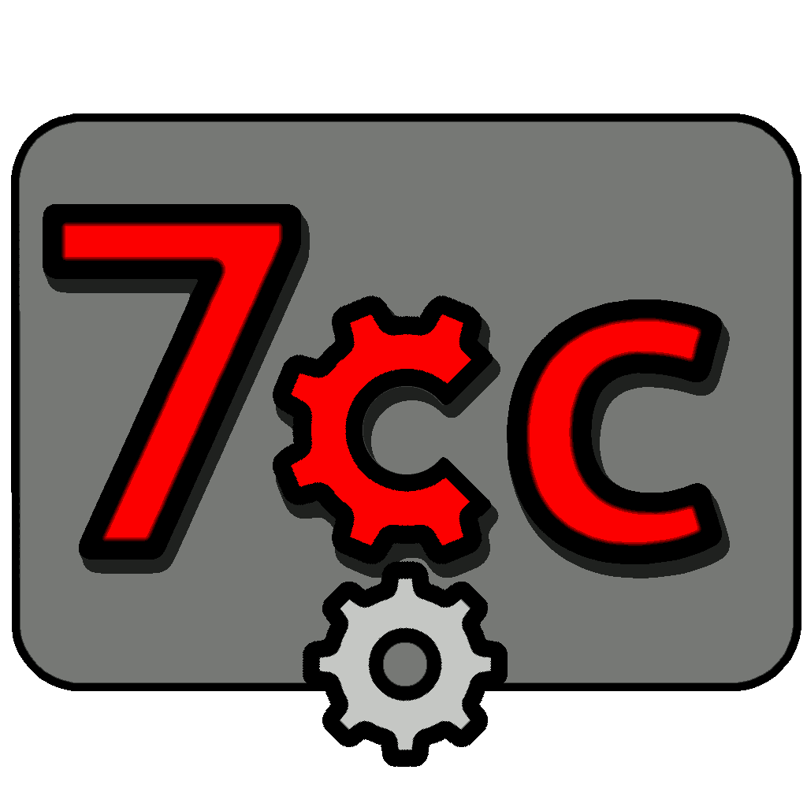

 7 Days to Die Code Compiler
============================================================================================================

7cc is inspired by most C compilers.
But instead of compiling C code to machine language, it translates Lua calls to the given XML files.

7cc operation is simple at first, but later it will be fully developed as compiler and interpreter.

At this very moment, 7cc only works with Lua language.

Building
--------

7cc depends on Lua only and it is required to compile:

```sh
git clone https://codeberg.org/SimplyCEO/7cc.git
cd 7cc/
make BUILD_TYPE=Release
```

Makefile:
- CC: C compiler;
- CFLAGS: C compiler flags;
- LDFLAGS: Linker flags;
- OSNAME: The Operating System type name (unix32: BSD/Linux, win64: ReactOS/Windows);
- BUILD64: Compile binary for 64-bit architecture;
- BUILD_TYPE: `Debug` or `Release`;
- BUILTIN_LUA: Use the compiled library from repository `vendor`;
- INSTALL_PREFIX: Installation prefix for built binary;

Installation
------------

The compiled binary will be located inside `bin` directory.
It can also be installed using the `INSTALL_PREFIX=/usr/local` option.

```sh
su -c 'make INSTALL_PREFIX=/usr/local install'
```

For portable installation:

```sh
make install
```

TODO
----

- Provide 7CC API documentation;
- Release stable version to public;

